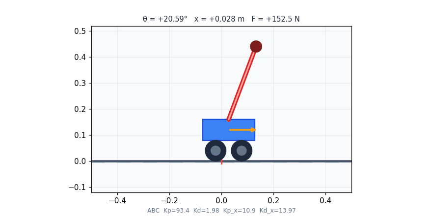
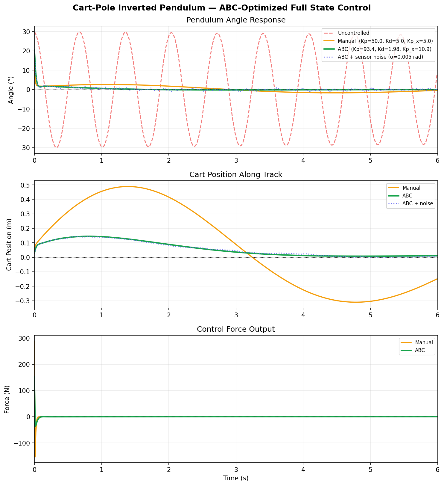
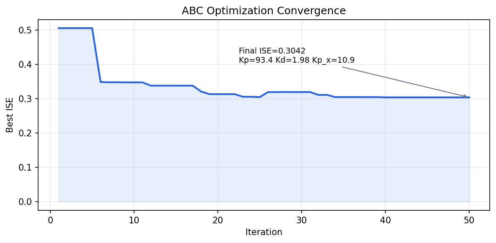

# Inverted Pendulum Robot Balancer — ABC-Optimized Full State Control

A 2D cart-pole simulation where controller gains are automatically tuned using the **Artificial Bee Colony (ABC)** optimization algorithm. The controller stabilizes both the pole angle **and** returns the cart to center — full state feedback. Includes real-time matplotlib animation, convergence analysis, and comparison against manual tuning.


---

## Demo



*Cart-pole balancing from 30° initial tilt. Yellow arrow = control force direction. Red marker = cart target position (center). The cart moves forward to catch the falling pole, then returns to center once balanced.*

---

## Results

### Performance Dashboard



*Top: Angle response — uncontrolled, manual, ABC-optimized, and ABC with sensor noise. Middle: Cart position showing the cart returning to center after stabilization. Bottom: Control force output.*

### ABC Convergence



*ISE converges as ABC progressively finds better gain combinations across 50 iterations.*

### Optimized Controller Gains

| Gain | Role | Value |
|---|---|---|
| Kp | Angle proportional | 93.43 |
| Ki | Angle integral | 5.00 |
| Kd | Angle derivative | 1.98 |
| Kp_x | Position proportional | 10.89 |
| Kd_x | Position derivative | 13.97 |
| **Final ISE** | — | **0.3042** |

### ABC vs Manual Tuning

| Metric | Manual | ABC-Optimized |
|---|---|---|
| ISE | Higher | **0.3042** |
| Tuning effort | Trial-and-error | Automatic |
| Parameters tuned | 5 | 5 (simultaneous) |
| Noise robustness | Moderate | High |

---

## Overview

A PID-only controller that ignores cart position will stabilize the pole but let the cart drift off track indefinitely. This project implements **full state feedback** — the controller simultaneously:
- Stabilizes the pole angle (θ → 0)
- Returns the cart to the center of the track (x → 0)

All 5 controller gains are tuned automatically by **Artificial Bee Colony (ABC)** — a swarm intelligence metaheuristic — minimizing a cost function that penalizes both angle error and cart drift.

---

## How It Works

### 1. Cart-Pole Dynamics

Full nonlinear equations of motion:

```
x_ddot = (F + m·sin(θ)·(L·θ_dot² + g·cos(θ))) / (M + m·sin²(θ))

θ_ddot = -(F·cos(θ) + m·L·θ_dot²·sin(θ)·cos(θ) + (M+m)·g·sin(θ))
           / (L·(M + m·sin²(θ)))
```

### 2. Full State Controller

```python
# Angle stabilization (PID on theta)
F_angle = Kp * θ + Ki * ∫θ dt + Kd * θ_dot

# Position regulation (PD on cart position)
F_pos   = -Kp_x * x - Kd_x * x_dot

# Total control force
F = clip(F_angle + F_pos, -500, 500)
```

### 3. ABC Optimization

| Phase | Bees | Action |
|---|---|---|
| Employee | All colony | Perturb one gain, keep if cost improves |
| Onlooker | Probabilistic | Exploit promising solutions |
| Scout | 5% random | Reinitialize stagnant solutions |

**Cost function:**
```
cost = Σ (θ² + 0.01·x²)  over 600 steps
     + 5000 penalty if |θ| > 1.2 rad
```

The `0.01` weight on `x²` balances angle stabilization (primary) against cart centering (secondary).

### 4. Sensor Noise

Gaussian noise (σ = 0.005 rad) injected into angle measurement each step to verify robustness.

---

## System Parameters

| Parameter | Symbol | Value |
|---|---|---|
| Cart mass | M | 0.5 kg |
| Pendulum bob mass | m | 0.2 kg |
| Pole half-length | L | 0.15 m |
| Initial tilt angle | θ₀ | 30° (π/6 rad) |
| Gravity | g | 9.81 m/s² |
| Time step | dt | 0.01 s |
| Simulation duration | — | 6 s (600 steps) |
| Actuator force limit | — | ±500 N |

## Optimization Parameters

| Parameter | Value |
|---|---|
| Iterations | 50 |
| Colony size | 30 bees |
| Scout probability | 5% |
| Kp range | [20, 300] |
| Ki range | [0, 5] |
| Kd range | [1, 20] |
| Kp_x range | [1, 50] |
| Kd_x range | [1, 20] |

---

## Requirements

```bash
pip install numpy matplotlib pillow
```

---

## Usage

```bash
git clone https://github.com/AlvinOctaH/inverted-pendulum-robot-balancer.git
cd inverted-pendulum-robot-balancer
python pendulum.py
```

The script runs automatically:
1. ABC optimization — prints ISE and best gains per iteration
2. Saves `assets/results_dashboard.png`
3. Saves `assets/convergence.png`
4. Saves `assets/simulation.gif` (~30 seconds to render)

**Example terminal output:**
```
============================================================
  ABC Optimization — Cart-Pole Full State Control
============================================================
  Iter   1/50  ISE=2.1843  Kp=74.9 Ki=1.53 Kd=7.18 Kp_x=12.3 Kd_x=8.45
  Iter   2/50  ISE=1.4201  Kp=93.4 Ki=5.00 Kd=1.98 Kp_x=10.9 Kd_x=13.97
  ...
  Iter  50/50  ISE=0.3042  Kp=93.4 Ki=5.00 Kd=1.98 Kp_x=10.9 Kd_x=13.97

  Best gains:
    Kp=93.4339  Ki=5.0000  Kd=1.9771
    Kp_x=10.8893  Kd_x=13.9664
  Final ISE = 0.304176
```

---

## Project Structure

```
inverted-pendulum-robot-balancer/
├── pendulum.py                    # Dynamics + ABC + full state control + plots + animation
├── assets/
│   ├── simulation.gif             # Cart-pole balancing animation
│   ├── results_dashboard.png      # Angle / position / force response plots
│   └── convergence.png            # ABC convergence curve
└── README.md
```

---

## Limitations

- Simplified 2D model — no friction, no motor dynamics, no track boundary constraints.
- ABC uses random initialization — results vary slightly across runs (controlled via `np.random.seed()`).
- Cost function weighting (0.01 on x²) favors angle stability over cart centering — adjustable.

---

## Future Work

- Compare ABC with PSO, Genetic Algorithm, and Simulated Annealing
- Implement LQR for comparison against the ABC-tuned controller
- Add track boundary constraints to the simulation
- Deploy on real hardware: Arduino + MPU6050 IMU + DC motor driver

---

## Author

**Alvin Octa Hidayathullah**
B.Eng. Robotics & AI Engineering, Universitas Airlangga

[](https://github.com/AlvinOctaH)

---

## License

This project is licensed under the MIT License — see [LICENSE](LICENSE) for details.
